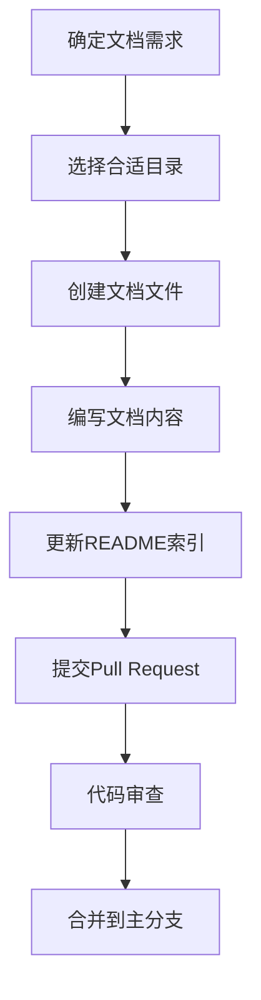

# PktMask 项目 docs 目录结构使用说明

> **版本**: v1.0.0  
> **创建日期**: 2025-07-22  
> **适用范围**: PktMask ≥ 4.0.0  
> **维护状态**: ✅ 活跃维护  

---

## 1. 执行摘要

### 1.1 文档体系概述

PktMask 项目采用分层分类的文档管理体系，通过标准化的目录结构和命名规范，确保文档的一致性、可维护性和可扩展性。本指南为开发团队提供完整的文档管理规范和操作指导。

### 1.2 核心设计原则

- **受众导向**: 按用户类型（最终用户、开发者、架构师）分类组织
- **生命周期管理**: 区分活跃文档、历史存档和废弃内容
- **层级清晰**: 采用树状结构，每层职责明确
- **标准化**: 统一的命名规范、格式要求和更新流程

---

## 2. 目录结构树状图

```
docs/
├── README.md                           # 📚 文档中心总入口
├── DOCS_DIRECTORY_STRUCTURE_GUIDE.md   # 📋 本指南文档
│
├── user/                               # 👥 用户文档
│   ├── README.md                       # 用户文档导航
│   ├── installation-guide.md           # 安装指南
│   ├── quick-start.md                  # 快速开始
│   ├── user-guide.md                   # 完整用户手册
│   ├── maskstage-guide.md              # MaskStage 功能指南
│   └── troubleshooting.md              # 故障排除
│
├── dev/                                # 🛠️ 开发者文档
│   ├── README.md                       # 开发者文档导航
│   ├── contributing.md                 # 贡献指南
│   ├── development-setup.md            # 开发环境设置
│   ├── coding-standards.md             # 编码规范
│   ├── testing-guide.md                # 测试指南
│   └── ARCHITECTURE_UNIFICATION_*.md   # 架构迁移文档
│
├── api/                                # 📚 API 文档
│   ├── README.md                       # API 文档导航
│   ├── core-api.md                     # 核心 API 参考
│   ├── pipeline-api.md                 # 管道 API 参考
│   └── tools-api.md                    # 工具 API 参考
│
├── architecture/                       # 🏛️ 架构文档
│   ├── README.md                       # 架构文档导航
│   ├── system-overview.md              # 系统概览
│   ├── pipeline-architecture.md        # 管道架构设计
│   ├── gui-architecture.md             # GUI 架构设计
│   ├── design-decisions.md             # 设计决策记录
│   └── NEW_MASKSTAGE_UNIFIED_DESIGN.md # 新架构设计方案
│
├── tools/                              # 🔧 工具文档
│   ├── README.md                       # 工具文档导航
│   ├── tls-flow-analyzer.md            # TLS 流量分析工具
│   ├── tls23-marker.md                 # TLS23 标记工具
│   ├── tls23-validator.md              # TLS23 验证工具
│   └── maskstage-validator.md          # MaskStage 验证工具
│
└── archive/                            # 📦 历史存档
    ├── README.md                       # 存档文档导航
    ├── completed-projects/             # 已完成项目
    │   ├── PKTMASK_COMPREHENSIVE_*.md  # 架构审查报告
    │   └── ...                         # 其他完成项目
    ├── deprecated-features/            # 废弃功能
    │   ├── PYSHARK_ANALYZER_*.md       # 迁移指南
    │   └── ...                         # 其他废弃功能
    └── legacy-docs/                    # 遗留文档
        └── ...                         # 历史版本文档
```

---

## 3. 各子目录详细说明

### 3.1 user/ - 用户文档

**目标受众**: 最终用户、系统管理员  
**内容特点**: 面向使用的操作指南，避免技术实现细节  

| 文档类型 | 文件名模式 | 用途说明 |
|----------|------------|----------|
| 安装指南 | `installation-guide.md` | 系统要求、依赖安装、配置步骤 |
| 快速开始 | `quick-start.md` | 5-10分钟上手体验 |
| 用户手册 | `user-guide.md` | 完整功能使用说明 |
| 功能指南 | `{功能名}-guide.md` | 特定功能详细说明 |
| 故障排除 | `troubleshooting.md` | 常见问题和解决方案 |

### 3.2 dev/ - 开发者文档

**目标受众**: 贡献者、维护者、新开发者  
**内容特点**: 技术实现细节、开发流程、规范标准  

| 文档类型 | 文件名模式 | 用途说明 |
|----------|------------|----------|
| 贡献指南 | `contributing.md` | 参与开发的流程和规范 |
| 环境设置 | `development-setup.md` | 开发环境配置指南 |
| 编码规范 | `coding-standards.md` | 代码风格和质量标准 |
| 测试指南 | `testing-guide.md` | 测试策略和执行方法 |
| 迁移文档 | `{项目名}_MIGRATION_*.md` | 重大架构变更记录 |

### 3.3 api/ - API 文档

**目标受众**: 集成开发者、高级用户  
**内容特点**: 编程接口参考、代码示例、参数说明  

| 文档类型 | 文件名模式 | 用途说明 |
|----------|------------|----------|
| 核心 API | `core-api.md` | 基础功能编程接口 |
| 管道 API | `pipeline-api.md` | 处理管道编程接口 |
| 工具 API | `tools-api.md` | 专用工具编程接口 |
| 模块 API | `{模块名}-api.md` | 特定模块编程接口 |

### 3.4 architecture/ - 架构文档

**目标受众**: 架构师、高级开发者、技术决策者  
**内容特点**: 系统设计、技术选型、架构演进  

| 文档类型 | 文件名模式 | 用途说明 |
|----------|------------|----------|
| 系统概览 | `system-overview.md` | 整体架构和核心概念 |
| 模块架构 | `{模块名}-architecture.md` | 特定模块架构设计 |
| 设计决策 | `design-decisions.md` | 重要技术决策记录 |
| 设计方案 | `{项目名}_DESIGN.md` | 新功能设计方案 |

### 3.5 tools/ - 工具文档

**目标受众**: 高级用户、运维人员、开发者  
**内容特点**: 专用工具使用指南、参数说明、使用示例  

| 文档类型 | 文件名模式 | 用途说明 |
|----------|------------|----------|
| 工具指南 | `{工具名}.md` | 单个工具完整使用指南 |
| 批处理指南 | `batch-{功能}.md` | 批量处理工具指南 |
| 集成指南 | `{工具名}-integration.md` | 工具集成使用指南 |

### 3.6 archive/ - 历史存档

**目标受众**: 项目维护者、历史研究者  
**内容特点**: 历史记录、废弃功能、完成项目  

| 存档类型 | 目录结构 | 用途说明 |
|----------|----------|----------|
| 已完成项目 | `completed-projects/` | 重大项目完成记录 |
| 废弃功能 | `deprecated-features/` | 不再支持功能的文档 |
| 遗留文档 | `legacy-docs/` | 历史版本文档 |

---

## 4. 文档命名和格式规范

### 4.1 文件命名规范

#### 基本规则
- 使用小写字母和连字符 (`kebab-case`)
- 避免空格和特殊字符
- 文件名应具有描述性

#### 命名模式
```
{功能/模块名}-{文档类型}.md
```

#### 示例
```
✅ 正确命名
- installation-guide.md
- tls-flow-analyzer.md
- system-overview.md
- maskstage-validator.md

❌ 错误命名
- Installation Guide.md
- TLS_Flow_Analyzer.md
- systemOverview.md
- MaskStageValidator.MD
```

### 4.2 文档格式标准

#### 文档头部信息
```markdown
# 文档标题

> **版本**: v1.0.0  
> **创建日期**: YYYY-MM-DD  
> **最后更新**: YYYY-MM-DD  
> **适用范围**: PktMask ≥ X.Y.Z  
> **维护状态**: ✅ 活跃维护 / 🔄 更新中 / ⚠️ 待更新 / 📦 已存档  

---
```

#### 章节结构
```markdown
## 1. 概述/执行摘要
### 1.1 子章节

## 2. 主要内容
### 2.1 子章节
### 2.2 子章节

## 3. 详细说明
### 3.1 子章节

---

> 💡 **提示**: 补充说明或注意事项
```

#### 代码块格式
```markdown
# 命令行示例
```bash
./pktmask mask input.pcap -o output.pcap
```

# Python 代码示例
```python
from pktmask.core import PktMask
pktmask = PktMask()
```

# 配置文件示例
```yaml
processing:
  mode: enhanced
  protocols: [tls, http]
```
```

---

## 5. README.md 索引文档规范

### 5.1 标准结构模板

每个子目录的 `README.md` 应包含以下标准结构：

```markdown
# {目录名称}文档

{目录用途简介}

## 📖 文档列表

### 🚀 {分类1}
- **[文档标题](文件名.md)** - 简短描述

### 📚 {分类2}
- **[文档标题](文件名.md)** - 简短描述

## 🎯 使用流程

### {用户类型}推荐路径
1. **步骤1** → [文档链接](文件名.md)
2. **步骤2** → [文档链接](文件名.md)

## 🔗 相关资源

- **[相关文档](../other/)** - 说明
- **[外部链接](https://example.com)** - 说明

---

> 💡 **提示**: 使用建议或注意事项
```

### 5.2 图标使用规范

| 图标 | 用途 | 示例 |
|------|------|------|
| 📚 | 文档、学习资料 | 文档列表、API参考 |
| 🚀 | 快速开始、入门 | 安装指南、快速开始 |
| 🛠️ | 开发、工具 | 开发文档、工具指南 |
| 🏛️ | 架构、设计 | 架构文档、设计方案 |
| 🔧 | 配置、维护 | 配置指南、故障排除 |
| 📦 | 存档、历史 | 历史文档、废弃功能 |
| 🎯 | 目标、流程 | 使用流程、推荐路径 |
| 🔗 | 链接、关联 | 相关资源、外部链接 |
| 💡 | 提示、建议 | 使用提示、注意事项 |
| ⚠️ | 警告、注意 | 重要提醒、风险说明 |

---

## 6. 文档创建和更新流程

### 6.1 新文档创建流程



#### 详细步骤

1. **需求分析**
   - 确定目标受众
   - 明确文档用途
   - 评估内容范围

2. **目录选择**
   - 根据受众选择主目录
   - 确定文档分类
   - 检查是否有重复内容

3. **文档创建**
   - 使用标准命名规范
   - 应用文档格式模板
   - 编写完整内容

4. **索引更新**
   - 更新相应的 README.md
   - 添加文档链接和描述
   - 检查链接有效性

5. **质量检查**
   - 内容准确性验证
   - 格式规范检查
   - 链接完整性测试

### 6.2 文档更新维护流程

#### 定期维护任务

| 频率 | 任务内容 | 负责人 |
|------|----------|--------|
| 每周 | 检查链接有效性 | 文档维护者 |
| 每月 | 更新过时内容 | 相关模块负责人 |
| 每季度 | 整体结构优化 | 架构师 |
| 每年 | 存档历史文档 | 项目经理 |

#### 更新触发条件

- 功能变更或新增
- Bug 修复影响用户使用
- 架构重构或迁移
- 用户反馈问题
- 定期维护检查

### 6.3 版本管理策略

#### 版本号规范
- 主版本号：重大架构变更
- 次版本号：功能新增或重要更新
- 修订版本号：内容修正或格式调整

#### 示例
```
v1.0.0 - 初始版本
v1.1.0 - 新增工具文档
v1.1.1 - 修正链接错误
v2.0.0 - 架构重构更新
```

---

## 7. 文档质量保证机制

### 7.1 内容质量标准

#### 准确性要求
- 技术信息必须准确无误
- 代码示例必须可执行
- 链接必须有效可访问
- 版本信息必须及时更新

#### 完整性要求
- 覆盖所有主要功能
- 包含必要的使用示例
- 提供故障排除信息
- 包含相关资源链接

#### 可读性要求
- 结构清晰，层次分明
- 语言简洁，表达准确
- 格式统一，样式一致
- 适合目标受众阅读

### 7.2 审查检查清单

#### 内容审查
- [ ] 技术信息准确性
- [ ] 代码示例可执行性
- [ ] 使用流程完整性
- [ ] 目标受众适配性

#### 格式审查
- [ ] 文档头部信息完整
- [ ] 章节结构规范
- [ ] 代码块格式正确
- [ ] 链接格式统一

#### 链接审查
- [ ] 内部链接有效性
- [ ] 外部链接可访问性
- [ ] README 索引更新
- [ ] 交叉引用正确性

### 7.3 用户反馈机制

#### 反馈渠道
- GitHub Issues
- Pull Requests
- 项目讨论区
- 用户调研

#### 处理流程
1. 收集用户反馈
2. 分类问题类型
3. 评估修改优先级
4. 安排修改计划
5. 实施更新
6. 验证改进效果

---

## 8. 工具和自动化支持

### 8.1 推荐工具

#### 文档编辑
- **Markdown 编辑器**: Typora, Mark Text, VSCode
- **图表工具**: Mermaid, Draw.io, PlantUML
- **截图工具**: Snipaste, LightShot

#### 质量检查
- **链接检查**: markdown-link-check
- **格式检查**: markdownlint
- **拼写检查**: cspell

#### 自动化工具
- **文档生成**: MkDocs, GitBook
- **API 文档**: Sphinx, pydoc
- **持续集成**: GitHub Actions

### 8.2 自动化检查脚本

#### 链接检查脚本
```bash
#!/bin/bash
# scripts/check-docs-links.sh
find docs/ -name "*.md" -exec markdown-link-check {} \;
```

#### 格式检查脚本
```bash
#!/bin/bash
# scripts/lint-docs.sh
markdownlint docs/ --config .markdownlint.json
```

#### 更新检查脚本
```bash
#!/bin/bash
# scripts/check-docs-freshness.sh
find docs/ -name "*.md" -mtime +90 -exec echo "需要更新: {}" \;
```

---

## 9. 最佳实践和建议

### 9.1 内容编写最佳实践

#### 用户导向原则
- 从用户角度组织内容
- 提供清晰的操作步骤
- 包含实际使用示例
- 预期用户可能遇到的问题

#### 技术写作技巧
- 使用主动语态
- 避免技术术语滥用
- 提供必要的背景信息
- 使用列表和表格提高可读性

#### 示例编写规范
- 代码示例必须完整可运行
- 提供预期输出结果
- 包含错误处理示例
- 注释关键步骤

### 9.2 维护管理建议

#### 责任分工
- **项目经理**: 整体文档策略和规划
- **架构师**: 架构文档的准确性
- **开发者**: 相关模块文档的及时更新
- **文档维护者**: 格式规范和链接检查

#### 协作机制
- 定期文档评审会议
- 文档更新通知机制
- 跨团队协作流程
- 知识传承计划

### 9.3 常见问题和解决方案

#### 问题1：文档更新不及时
**解决方案**：
- 将文档更新纳入开发流程
- 设置自动提醒机制
- 建立文档更新检查清单

#### 问题2：文档质量不一致
**解决方案**：
- 建立统一的文档模板
- 实施文档审查制度
- 提供文档写作培训

#### 问题3：用户找不到需要的文档
**解决方案**：
- 优化文档导航结构
- 改进搜索功能
- 提供多种访问路径

---

## 10. 总结和展望

### 10.1 当前成果

PktMask 项目已建立了完整的文档管理体系，包括：
- 清晰的目录结构和分类体系
- 标准化的命名规范和格式要求
- 完善的创建更新流程
- 有效的质量保证机制

### 10.2 持续改进计划

#### 短期目标（1-3个月）
- 完善所有 README.md 索引文档
- 实施自动化质量检查
- 建立用户反馈收集机制

#### 中期目标（3-6个月）
- 开发文档管理工具
- 建立文档指标监控
- 优化用户体验

#### 长期目标（6-12个月）
- 实现文档智能化管理
- 建立多语言支持
- 集成AI辅助写作

### 10.3 成功指标

- 文档覆盖率 ≥ 95%
- 用户满意度 ≥ 4.5/5.0
- 文档更新及时率 ≥ 90%
- 链接有效率 = 100%

---

> 💡 **提示**: 本指南是活跃维护的文档，会根据项目发展和用户反馈持续更新。如有建议或问题，请通过 GitHub Issues 反馈。

---

## 附录 A：文档模板

### A.1 用户指南模板

```markdown
# {功能名称} 用户指南

> **版本**: v1.0.0
> **适用范围**: PktMask ≥ X.Y.Z
> **目标受众**: 最终用户

## 1. 概述

### 1.1 功能介绍
{功能的基本介绍和用途}

### 1.2 主要特性
- 特性1：描述
- 特性2：描述
- 特性3：描述

## 2. 快速开始

### 2.1 前置条件
- 系统要求
- 依赖软件
- 权限要求

### 2.2 基本使用
```bash
# 基本命令示例
./pktmask {command} [options]
```

## 3. 详细功能

### 3.1 功能模块1
{详细说明}

### 3.2 功能模块2
{详细说明}

## 4. 常见问题

### 4.1 问题1
**问题描述**:
**解决方案**:

### 4.2 问题2
**问题描述**:
**解决方案**:

## 5. 相关资源

- [相关文档](链接)
- [API 参考](链接)

---

> 💡 **提示**: 使用建议或注意事项
```

### A.2 开发者文档模板

```markdown
# {模块名称} 开发指南

> **版本**: v1.0.0
> **适用范围**: PktMask ≥ X.Y.Z
> **目标受众**: 开发者、贡献者

## 1. 概述

### 1.1 模块介绍
{模块的技术介绍和架构位置}

### 1.2 核心概念
- 概念1：定义和说明
- 概念2：定义和说明

## 2. 架构设计

### 2.1 模块结构
```
module/
├── core/
├── utils/
└── tests/
```

### 2.2 关键类和接口
```python
class ExampleClass:
    """类的用途说明"""

    def method_example(self, param: str) -> bool:
        """方法说明"""
        pass
```

## 3. 开发指南

### 3.1 环境设置
{开发环境配置步骤}

### 3.2 编码规范
{特定于此模块的编码规范}

### 3.3 测试要求
{测试策略和要求}

## 4. API 参考

### 4.1 核心 API
{API 详细说明}

### 4.2 工具函数
{工具函数说明}

## 5. 示例代码

### 5.1 基本使用
```python
# 示例代码
from module import ExampleClass

example = ExampleClass()
result = example.method_example("parameter")
```

### 5.2 高级用法
```python
# 高级示例代码
```

---

> 💡 **提示**: 开发相关的提示和建议
```

### A.3 工具文档模板

```markdown
# {工具名称} 使用指南

> **版本**: v1.0.0
> **适用范围**: PktMask ≥ X.Y.Z
> **工具类型**: 命令行工具 / GUI工具 / API工具

## 1. 功能概述

### 1.1 工具介绍
{工具的用途和主要功能}

### 1.2 核心功能
1. **功能1**: 描述
2. **功能2**: 描述
3. **功能3**: 描述

## 2. 安装与配置

### 2.1 系统要求
- 操作系统：支持的系统版本
- Python：版本要求
- 依赖：外部依赖列表

### 2.2 安装步骤
```bash
# 安装命令
pip install requirements
```

## 3. 使用方法

### 3.1 基本语法
```bash
{tool-name} [options] input-file [output-file]
```

### 3.2 参数说明
| 参数 | 类型 | 必需 | 说明 |
|------|------|------|------|
| `--option1` | string | 是 | 参数说明 |
| `--option2` | int | 否 | 参数说明 |

### 3.3 使用示例
```bash
# 基本使用
{tool-name} input.pcap

# 高级使用
{tool-name} --option1 value --option2 123 input.pcap output.pcap
```

## 4. 输出格式

### 4.1 标准输出
{输出格式说明}

### 4.2 文件输出
{文件输出格式说明}

## 5. 故障排除

### 5.1 常见错误
| 错误信息 | 原因 | 解决方案 |
|----------|------|----------|
| Error 1 | 原因描述 | 解决步骤 |
| Error 2 | 原因描述 | 解决步骤 |

---

> 💡 **提示**: 工具使用的最佳实践建议
```

---

## 附录 B：自动化脚本

### B.1 文档链接检查脚本

```bash
#!/bin/bash
# scripts/docs/check-links.sh
# 检查文档中的链接有效性

set -e

echo "🔍 检查文档链接有效性..."

# 检查内部链接
echo "检查内部链接..."
find docs/ -name "*.md" -exec grep -l "\](\.\./" {} \; | while read file; do
    echo "检查文件: $file"
    grep -n "\](\.\./" "$file" | while IFS=: read -r line_num link_line; do
        # 提取链接路径
        link_path=$(echo "$link_line" | sed -n 's/.*](\([^)]*\)).*/\1/p')
        if [[ -n "$link_path" ]]; then
            # 转换相对路径为绝对路径
            abs_path=$(dirname "$file")/"$link_path"
            if [[ ! -f "$abs_path" ]]; then
                echo "❌ 无效链接: $file:$line_num -> $link_path"
            else
                echo "✅ 有效链接: $link_path"
            fi
        fi
    done
done

# 检查 README 索引完整性
echo "检查 README 索引完整性..."
for dir in docs/*/; do
    if [[ -f "$dir/README.md" ]]; then
        echo "检查目录: $dir"
        # 检查目录中的 .md 文件是否都在 README 中被引用
        find "$dir" -maxdepth 1 -name "*.md" ! -name "README.md" | while read md_file; do
            filename=$(basename "$md_file")
            if ! grep -q "$filename" "$dir/README.md"; then
                echo "⚠️  未在索引中: $md_file"
            fi
        done
    fi
done

echo "✅ 链接检查完成"
```

### B.2 文档格式检查脚本

```bash
#!/bin/bash
# scripts/docs/check-format.sh
# 检查文档格式规范

set -e

echo "📋 检查文档格式规范..."

# 检查文件命名规范
echo "检查文件命名规范..."
find docs/ -name "*.md" | while read file; do
    filename=$(basename "$file")
    # 检查是否使用 kebab-case
    if [[ ! "$filename" =~ ^[a-z0-9-]+\.md$ ]] && [[ "$filename" != "README.md" ]]; then
        echo "❌ 命名不规范: $file (应使用 kebab-case)"
    fi
done

# 检查文档头部信息
echo "检查文档头部信息..."
find docs/ -name "*.md" ! -name "README.md" | while read file; do
    if ! head -10 "$file" | grep -q "> \*\*版本\*\*:"; then
        echo "⚠️  缺少版本信息: $file"
    fi
    if ! head -10 "$file" | grep -q "> \*\*适用范围\*\*:"; then
        echo "⚠️  缺少适用范围: $file"
    fi
done

# 检查章节结构
echo "检查章节结构..."
find docs/ -name "*.md" | while read file; do
    # 检查是否有重复的章节编号
    section_numbers=$(grep "^## [0-9]" "$file" | sed 's/^## \([0-9]*\).*/\1/' | sort)
    duplicate_numbers=$(echo "$section_numbers" | uniq -d)
    if [[ -n "$duplicate_numbers" ]]; then
        echo "❌ 重复章节编号: $file -> $duplicate_numbers"
    fi
done

echo "✅ 格式检查完成"
```

### B.3 文档更新提醒脚本

```bash
#!/bin/bash
# scripts/docs/check-freshness.sh
# 检查文档更新时效性

set -e

echo "⏰ 检查文档更新时效性..."

# 设置时间阈值（天数）
WARN_DAYS=90
CRITICAL_DAYS=180

current_date=$(date +%s)

find docs/ -name "*.md" | while read file; do
    # 获取文件最后修改时间
    file_date=$(stat -f %m "$file" 2>/dev/null || stat -c %Y "$file" 2>/dev/null)
    days_old=$(( (current_date - file_date) / 86400 ))

    if [[ $days_old -gt $CRITICAL_DAYS ]]; then
        echo "🚨 严重过期 ($days_old 天): $file"
    elif [[ $days_old -gt $WARN_DAYS ]]; then
        echo "⚠️  需要更新 ($days_old 天): $file"
    fi
done

# 检查版本信息中的日期
echo "检查版本信息中的日期..."
find docs/ -name "*.md" | while read file; do
    # 提取文档中的日期信息
    doc_date=$(grep "> \*\*最后更新\*\*:" "$file" | sed 's/.*: \([0-9-]*\).*/\1/' | head -1)
    if [[ -n "$doc_date" ]]; then
        # 转换日期格式并计算差异
        doc_timestamp=$(date -d "$doc_date" +%s 2>/dev/null || echo "0")
        if [[ $doc_timestamp -gt 0 ]]; then
            days_since_update=$(( (current_date - doc_timestamp) / 86400 ))
            if [[ $days_since_update -gt $WARN_DAYS ]]; then
                echo "📅 文档日期过期: $file (上次更新: $doc_date, $days_since_update 天前)"
            fi
        fi
    fi
done

echo "✅ 时效性检查完成"
```

### B.4 文档统计脚本

```bash
#!/bin/bash
# scripts/docs/generate-stats.sh
# 生成文档统计信息

set -e

echo "📊 生成文档统计信息..."

# 统计文档数量
total_docs=$(find docs/ -name "*.md" | wc -l)
user_docs=$(find docs/user/ -name "*.md" | wc -l)
dev_docs=$(find docs/dev/ -name "*.md" | wc -l)
api_docs=$(find docs/api/ -name "*.md" | wc -l)
arch_docs=$(find docs/architecture/ -name "*.md" | wc -l)
tool_docs=$(find docs/tools/ -name "*.md" | wc -l)
archive_docs=$(find docs/archive/ -name "*.md" | wc -l)

# 统计文档大小
total_size=$(find docs/ -name "*.md" -exec wc -c {} + | tail -1 | awk '{print $1}')
total_lines=$(find docs/ -name "*.md" -exec wc -l {} + | tail -1 | awk '{print $1}')
total_words=$(find docs/ -name "*.md" -exec wc -w {} + | tail -1 | awk '{print $1}')

# 生成统计报告
cat << EOF > docs/DOCUMENTATION_STATS.md
# PktMask 文档统计报告

> **生成时间**: $(date '+%Y-%m-%d %H:%M:%S')
> **统计范围**: docs/ 目录下所有 Markdown 文件

## 📊 文档数量统计

| 分类 | 文档数量 | 占比 |
|------|----------|------|
| 用户文档 | $user_docs | $(( user_docs * 100 / total_docs ))% |
| 开发者文档 | $dev_docs | $(( dev_docs * 100 / total_docs ))% |
| API 文档 | $api_docs | $(( api_docs * 100 / total_docs ))% |
| 架构文档 | $arch_docs | $(( arch_docs * 100 / total_docs ))% |
| 工具文档 | $tool_docs | $(( tool_docs * 100 / total_docs ))% |
| 历史存档 | $archive_docs | $(( archive_docs * 100 / total_docs ))% |
| **总计** | **$total_docs** | **100%** |

## 📈 内容规模统计

| 指标 | 数值 |
|------|------|
| 总文件数 | $total_docs |
| 总字节数 | $(numfmt --to=iec $total_size) |
| 总行数 | $(numfmt --grouping $total_lines) |
| 总词数 | $(numfmt --grouping $total_words) |
| 平均文件大小 | $(( total_size / total_docs )) 字节 |
| 平均文件行数 | $(( total_lines / total_docs )) 行 |

## 🔗 链接统计

EOF

# 统计链接数量
internal_links=$(find docs/ -name "*.md" -exec grep -o "\](\.\./" {} \; | wc -l)
external_links=$(find docs/ -name "*.md" -exec grep -o "](http" {} \; | wc -l)

cat << EOF >> docs/DOCUMENTATION_STATS.md
| 链接类型 | 数量 |
|----------|------|
| 内部链接 | $internal_links |
| 外部链接 | $external_links |
| 总链接数 | $(( internal_links + external_links )) |

## 📅 更新活跃度

EOF

# 统计最近更新的文档
recent_docs=$(find docs/ -name "*.md" -mtime -30 | wc -l)
old_docs=$(find docs/ -name "*.md" -mtime +90 | wc -l)

cat << EOF >> docs/DOCUMENTATION_STATS.md
| 时间范围 | 文档数量 |
|----------|----------|
| 最近30天更新 | $recent_docs |
| 超过90天未更新 | $old_docs |
| 更新活跃度 | $(( recent_docs * 100 / total_docs ))% |

---

> 💡 **说明**: 此报告由自动化脚本生成，反映当前文档库的整体状况。
EOF

echo "✅ 统计报告已生成: docs/DOCUMENTATION_STATS.md"
```

---

## 附录 C：集成工作流

### C.1 GitHub Actions 工作流

```yaml
# .github/workflows/docs-quality.yml
name: Documentation Quality Check

on:
  push:
    paths:
      - 'docs/**'
  pull_request:
    paths:
      - 'docs/**'

jobs:
  docs-check:
    runs-on: ubuntu-latest

    steps:
    - name: Checkout code
      uses: actions/checkout@v3

    - name: Setup Node.js
      uses: actions/setup-node@v3
      with:
        node-version: '18'

    - name: Install dependencies
      run: |
        npm install -g markdownlint-cli
        npm install -g markdown-link-check

    - name: Check markdown format
      run: markdownlint docs/ --config .markdownlint.json

    - name: Check links
      run: |
        find docs/ -name "*.md" -exec markdown-link-check {} \;

    - name: Run custom checks
      run: |
        chmod +x scripts/docs/check-format.sh
        chmod +x scripts/docs/check-links.sh
        ./scripts/docs/check-format.sh
        ./scripts/docs/check-links.sh

    - name: Generate documentation stats
      run: |
        chmod +x scripts/docs/generate-stats.sh
        ./scripts/docs/generate-stats.sh

    - name: Upload stats artifact
      uses: actions/upload-artifact@v3
      with:
        name: documentation-stats
        path: docs/DOCUMENTATION_STATS.md
```

### C.2 Pre-commit Hook

```bash
#!/bin/bash
# .git/hooks/pre-commit
# 提交前检查文档质量

set -e

echo "🔍 运行文档质量检查..."

# 检查是否有文档文件被修改
docs_changed=$(git diff --cached --name-only | grep "^docs/" | grep "\.md$" || true)

if [[ -n "$docs_changed" ]]; then
    echo "检测到文档变更，运行质量检查..."

    # 运行格式检查
    if [[ -x "scripts/docs/check-format.sh" ]]; then
        ./scripts/docs/check-format.sh
    fi

    # 运行链接检查
    if [[ -x "scripts/docs/check-links.sh" ]]; then
        ./scripts/docs/check-links.sh
    fi

    echo "✅ 文档质量检查通过"
else
    echo "ℹ️  无文档变更，跳过检查"
fi
```

---

**文档维护者**: PktMask 开发团队
**最后更新**: 2025-07-22
**下次审查**: 2025-10-22
