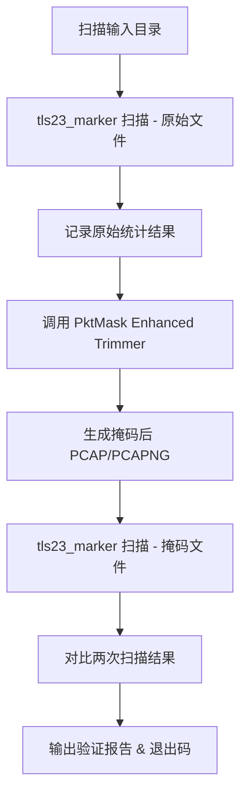

# TLS23 端到端掩码验证测试方案

> 版本：v1.0 · 适用范围：PktMask ≥ 3.0 · 作者：AI 设计助手

---

## 1. 背景与目标

PktMask 已内置 *Enhanced Trimmer*（载荷裁切）功能，可对 TLS `23 (Application Data)` 消息体进行 **MaskAfter(5)** 字节级掩码。为了持续验证该功能的有效性，需要一套 **端到端自动化测试脚本** 来检测：

1. 主体程序是否准确识别 TLS 23 数据帧；
2. 掩码后 TLS 23 消息体是否被成功置零；
3. 其他 TLS/non-TLS 帧内容保持不变。

> 要求：**不修改** `tls23_marker` 与 PktMask 主体代码，仅调用其 **公开 CLI / API** 完成验证流程。

---

## 2. 整体流程



---

## 3. 目录结构建议

```
scripts/
  validation/
    ├── tls23_e2e_validator.py   # 主脚本
    └── __init__.py
output/
  tls23_e2e/
    ├── <file>_orig_tls23.json
    ├── <file>_masked_tls23.json
    └── validation_summary.json
```

---

## 4. 关键实现要点

1. **输入发现**
   * 递归扫描 `--input-dir` 下所有 `.pcap` / `.pcapng` 文件。
   * 支持 `--glob "**/*.pcapng"` 自定义过滤。
2. **首次扫描**
   * 依赖命令：
     ```bash
     python -m pktmask.tools.tls23_marker --pcap <file> --no-annotate --formats json --output-dir <out>
     ```
   * 仅保留生成的 `<file>_tls23_frames.json` 作为 **原始统计结果**。
3. **调用主体程序掩码**
   * 以 *Headless* 方式调用 `IndependentPcapMasker.mask_pcap_with_sequences()` 或使用 CLI：
     ```bash
     python -m pktmask --mode trim --input <file> --output <masked>
     ```
   * 输出文件命名规则：`<stem>_masked<suffix>`。
4. **二次扫描**
   * 使用相同参数调用 `tls23_marker` 扫描掩码后的文件，生成 `<file>_masked_tls23_frames.json`。
5. **结果对比逻辑**
   * **成功判定**（每文件）：
     1. `total_records_original == total_records_masked`（确认 TLS23 帧计数未变）。
     2. `zero_bytes_masked == lengths_sum_masked`（掩码后零字节数等于总长度，表示已全部置零）。
     3. 对应帧 `frame.number` 集合一致（帧未丢失/新增）。
   * 汇总统计 *overall_pass_rate* ≥ 100% 时退出码 0；否则退出码 1。
6. **报告输出**
   * `validation_summary.json`：按文件列出 `status`、`records_before`、`records_after`、`masked_ok_frames / failed_frames` 等字段。
   * 控制台打印彩色摘要（可选 `--no-color`）。

---

## 5. CLI 设计

```bash
python scripts/validation/tls23_e2e_validator.py \
  --input-dir tests/data/tls \
  --output-dir output/tls23_e2e \
  --pktmask-mode trim \
  [--glob "**/*.pcap"] \
  [--verbose]
```

| 选项 | 默认值 | 说明 |
|------|--------|------|
| `--input-dir` | 必填 | 待验证的 PCAP/PCAPNG 目录 |
| `--output-dir` | `output/tls23_e2e` | 结果与报告输出目录 |
| `--pktmask-mode` | `trim` | 调用主体程序的处理模式 (未来可扩展) |
| `--glob` | `**/*.{pcap,pcapng}` | 文件匹配规则 |
| `--verbose` | 关闭 | 打印详细调试信息 |

退出码：`0` 全部通过 · `1` 至少 1 个文件失败 · `2` 输入目录无匹配文件 · `3` 运行时异常。

---

## 6. 可靠性与可维护性

* **零侵入**：仅调用既有公共接口，无需修改 `tls23_marker` 或 PktMask 源码。
* **可扩展**：验证逻辑封装为独立函数，后续可轻松添加其他协议/策略测试。
* **性能优化**：
  * 使用 `--no-annotate` 减少 IO 开销；
  * 支持 `--parallel N`（后续扩展）并行处理多个文件。
* **CI 友好**：纯 CLI，无 GUI 依赖。适用于 GitHub Actions、GitLab CI、Jenkins 等。

---

## 7. 后续扩展方向（可选）

1. 增加 HTML 报告生成功能，图表化展示各项指标。
2. 引入 pytest 插件，将脚本包装成测试夹具，融入现有测试框架。
3. 支持阈值参数，如 *允许少量未掩码字节*，以适应特定场景。

---

## 8. 结论

该方案以 **简单、清晰、可持续** 为设计原则，充分利用现有工具链，通过两次 `tls23_marker` 扫描与差异对比，实现对 PktMask *Enhanced Trimmer* 功能的端到端自动化验证，可无缝集成到现有 CI/CD 流程并易于后续扩展。

---

## 9. 实施状态与进度（2025-06-27）

- [x] 主脚本 `scripts/validation/tls23_e2e_validator.py` 已开发完成并合并至代码库。
- [x] 独立使用说明文档 `docs/TLS23_E2E_VALIDATOR_USAGE.md` 已创建。
- [x] 在 `tests/data/tls/` 样本集上执行验证，**Overall Pass Rate = 100%**。
- [ ] CI 集成：已提交 CI 配置变更以加入 `tls23_e2e` 任务（待主干合并）。

> 本章节用于跟踪实现进度，请在后续迭代中同步更新。 