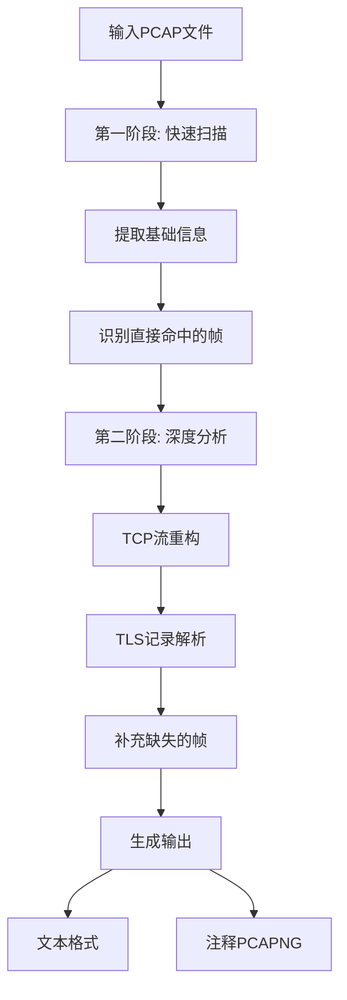

# TLS Application Data 标记工具设计方案

## 1. 概述

### 1.1 工具目标
开发一个独立的TLS Application Data标记工具，用于识别并标记PCAP/PCAPNG文件中所有包含TLS content-type = 23的流量，支持复杂网络场景如多层封装、分段、乱序、丢包等。

### 1.2 核心特性
- **全场景覆盖**：支持单/双VLAN、VXLAN、GRE、MPLS、IP-in-IP等各种封装
- **分段识别**：处理TLS记录头被拆分、Body分段等复杂情况  
- **容错能力**：在TCP乱序、丢包、IP分片情况下仍能准确识别
- **双输出模式**：支持文本列表和PCAPNG注释两种输出格式
- **独立部署**：可命令行单独使用，也可作为模块被其他程序引用

## 2. 技术要求

### 2.1 依赖环境
- **Wireshark/tshark**: ≥ 4.2.0 (确保TLS解析完整性)
- **Python**: ≥ 3.9
- **操作系统**: 跨平台支持 (Linux/Windows/macOS)

### 2.2 关键参数配置
```bash
# tshark重组参数
-o tcp.desegment_tcp_streams:true
-o ip.defragment:true  
-o tls.desegment_ssl_records:true
```

## 3. 架构设计

### 3.1 目录结构
```
src/pktmask/tools/
├── tls_marker/
│   ├── __init__.py
│   ├── core/
│   │   ├── __init__.py
│   │   ├── tshark_analyzer.py      # tshark调用和数据提取
│   │   ├── stream_processor.py     # TCP流处理和TLS重构  
│   │   ├── frame_marker.py         # 帧标记逻辑
│   │   └── output_generator.py     # 输出格式生成
│   ├── cli.py                      # 命令行接口
│   ├── api.py                      # 编程接口
│   └── config.py                   # 配置管理
└── __init__.py
```

### 3.2 存放位置说明
- **位置**: `src/pktmask/tools/tls_marker/`
- **理由**: 
  - 作为PktMask工具集的一部分，与现有项目架构保持一致
  - `tools`目录表明这是独立工具，可单独使用
  - 便于与现有配置、日志、错误处理等基础设施集成

### 3.3 核心模块设计

#### 3.3.1 TSharkAnalyzer (tshark_analyzer.py)
```python
class TSharkAnalyzer:
    """负责调用tshark并提取基础数据"""
    
    def __init__(self, pcap_file: str, decode_as: List[str] = None):
        self.pcap_file = pcap_file
        self.decode_as = decode_as or []
        
    def extract_basic_info(self) -> List[Dict]:
        """第一遍扫描：提取帧号、协议路径、TCP流、TLS类型"""
        
    def extract_detailed_info(self, target_streams: Set[int]) -> Dict:
        """第二遍扫描：提取目标流的TCP序列号、负载等详细信息"""
```

#### 3.3.2 StreamProcessor (stream_processor.py)  
```python
class StreamProcessor:
    """处理TCP流重构和TLS记录分析"""
    
    def reconstruct_stream(self, records: List[Tuple]) -> Set[int]:
        """重构TCP流并识别TLS Application Data帧"""
        
    def find_split_headers(self, stream_data: bytes, frame_index: List) -> Set[int]:
        """查找TLS头部被拆分的帧"""
```

#### 3.3.3 FrameMarker (frame_marker.py)
```python
class FrameMarker:
    """统一的帧标记逻辑"""
    
    def mark_frames(self, hits_by_stream: Dict[int, Set[int]], 
                   frame_protocols: Dict[int, str]) -> List[FrameInfo]:
        """整合所有命中帧并生成标记信息"""
```

#### 3.3.4 OutputGenerator (output_generator.py)
```python
class OutputGenerator:
    """生成多种输出格式"""
    
    def generate_text_output(self, marked_frames: List[FrameInfo]) -> Dict:
        """生成JSON/CSV文本输出"""
        
    def generate_annotated_pcap(self, marked_frames: List[FrameInfo]) -> str:
        """生成带注释的PCAPNG文件"""
```

## 4. 处理流程

### 4.1 两阶段分析流程


### 4.2 详细处理步骤

#### 步骤1: 快速识别 (第一阶段)
```python
# 提取最少字段，保持速度
tshark_cmd = [
    "tshark", "-r", pcap_file, "-2",
    "-o", "tcp.desegment_tcp_streams:true",
    "-o", "ip.defragment:true", 
    "-o", "tls.desegment_ssl_records:true",
    "-T", "json",
    "-e", "frame.number",
    "-e", "frame.protocols", 
    "-e", "tcp.stream",
    "-e", "tls.record.content_type",
    "-E", "occurrence=a"
]
```

#### 步骤2: 深度分析 (第二阶段)
```python
# 对有TLS流量的TCP流进行深度分析
detailed_cmd = tshark_cmd + [
    "-e", "tcp.seq_relative",
    "-e", "tcp.len", 
    "-e", "tcp.payload",
    f"tcp.stream in {{{','.join(map(str, target_streams))}}}"
]
```

#### 步骤3: 流级重构和补标记
```python
def scan_stream_for_split_records(records):
    """扫描TCP流，查找TLS头部被拆分的帧"""
    # 按序列号排序重构字节流
    # 解析TLS记录查找Application Data (0x17)
    # 标记所有相关帧
```

## 5. 输出格式

### 5.1 JSON格式 (程序友好)
```json
{
    "summary": {
        "total_frames": 1000,
        "marked_frames": 45,
        "tcp_streams": 3,
        "scan_time": "2025-01-02T10:30:00Z"
    },
    "marked_frames": [
        {
            "frame_number": 123,
            "protocol_path": "eth/ip/tcp/tls", 
            "tcp_stream": 0,
            "tls_record_types": ["23"],
            "reason": "direct_hit"
        }
    ]
}
```

### 5.2 CSV格式 (人类友好)  
```csv
frame_number,protocol_path,tcp_stream,tls_types,reason
123,eth/ip/tcp/tls,0,"[23]",direct_hit
124,eth/vlan/ip/tcp/tls,0,"[23]",split_body
```

### 5.3 注释PCAPNG
使用`editcap -A`在原始帧上添加注释：
```
123:TLS23(eth/ip/tcp/tls)
124:TLS23(eth/vlan/ip/tcp/tls)
```

## 6. 接口设计

### 6.1 命令行接口 (cli.py)
```bash
# 基本使用
python -m pktmask.tools.tls_marker --pcap sample.pcapng

# 自定义端口解码
python -m pktmask.tools.tls_marker --pcap sample.pcapng --decode-as 8443:tls,9443:tls

# 仅生成文本输出
python -m pktmask.tools.tls_marker --pcap sample.pcapng --no-annotate

# 指定输出目录
python -m pktmask.tools.tls_marker --pcap sample.pcapng --output-dir /tmp/results
```

### 6.2 编程接口 (api.py)
```python
from pktmask.tools.tls_marker import TLSApplicationDataMarker

# 基本使用
marker = TLSApplicationDataMarker()
result = marker.analyze_pcap("sample.pcapng")

# 高级配置
marker = TLSApplicationDataMarker(
    decode_as=["8443:tls", "9443:tls"],
    memory_limit=512*1024*1024,  # 512 MiB
    output_formats=["json", "csv"]
)
result = marker.analyze_pcap("sample.pcapng", output_dir="/tmp")
```

## 7. 配置管理

### 7.1 配置文件 (config.py)
```python
from dataclasses import dataclass
from typing import List, Optional

@dataclass 
class TLSMarkerConfig:
    """TLS标记工具配置"""
    tshark_path: Optional[str] = None
    memory_limit: int = 256 * 1024 * 1024  # 256 MiB
    decode_as: List[str] = None
    output_formats: List[str] = None
    timeout: int = 300  # 5分钟超时
    
    def __post_init__(self):
        if self.decode_as is None:
            self.decode_as = []
        if self.output_formats is None:
            self.output_formats = ["json", "pcapng"]
```

### 7.2 环境变量支持
```bash
export PKTMASK_TSHARK_PATH=/usr/local/bin/tshark
export PKTMASK_TLS_MEMORY_LIMIT=536870912  # 512 MiB
export PKTMASK_TLS_TIMEOUT=600
```

## 8. 错误处理

### 8.1 异常层次
```python
class TLSMarkerError(Exception):
    """TLS标记工具基础异常"""

class TSharkNotFoundError(TLSMarkerError):
    """tshark程序未找到"""

class TSharkVersionError(TLSMarkerError):
    """tshark版本不支持"""

class PCAPParseError(TLSMarkerError):
    """PCAP文件解析错误"""

class OutputGenerationError(TLSMarkerError):
    """输出生成错误"""
```

### 8.2 优雅降级
- tshark执行失败时提供详细错误信息
- 部分帧解析失败时继续处理其他帧
- 内存不足时自动调整批处理大小
- 超时时提供已处理的部分结果

## 9. 测试策略

### 9.1 测试数据准备
利用现有的 `tests/data/tls/` 目录中的测试文件：
- `tls_1_0_multi_segment_google-https.pcap` - 测试分段场景
- `ssl_3.pcapng` - 测试基础TLS识别
- 其他TLS相关测试文件

### 9.2 测试用例分类
```python
class TestTLSMarker:
    """完整的测试套件"""
    
    def test_basic_tls23_detection(self):
        """基础TLS Application Data识别"""
        
    def test_vlan_encapsulation(self):
        """VLAN封装场景"""
        
    def test_split_records(self):
        """TLS记录分段场景"""
        
    def test_out_of_order_packets(self):
        """TCP乱序场景"""
        
    def test_custom_ports(self):
        """自定义端口解码"""
        
    def test_output_formats(self):
        """输出格式验证"""
```

### 9.3 集成测试
```bash
# 回归测试脚本
tests/integration/test_tls_marker_regression.py

# 性能基准测试  
tests/performance/test_tls_marker_performance.py
```

## 10. 部署和集成

### 10.1 独立使用
```bash
# 直接作为Python模块执行
python -m pktmask.tools.tls_marker --help

# 安装后的命令行工具 (可选)
pktmask-tls-marker --help
```

### 10.2 集成到现有工具
```python
# 在PktMask其他模块中使用
from pktmask.tools.tls_marker import TLSApplicationDataMarker

def enhanced_pcap_analysis(pcap_file):
    marker = TLSApplicationDataMarker()
    tls_info = marker.analyze_pcap(pcap_file)
    # 结合其他分析结果...
```

### 10.3 自动化测试集成
```python
# 在现有测试流程中集成
from pktmask.tools.tls_marker import mark_tls_application_data

def test_pcap_processing():
    result = process_pcap("sample.pcapng")
    tls_marks = mark_tls_application_data("sample.pcapng")
    assert len(tls_marks.marked_frames) > 0
```

## 11. 性能考虑

### 11.1 优化策略
- **流式处理**: 大文件分批处理，避免内存溢出
- **缓存机制**: 缓存tshark执行结果，避免重复解析
- **并行处理**: 多个TCP流可并行分析
- **内存管理**: 动态调整TCP重组缓存大小

### 11.2 性能指标
- **小文件** (<100MB): <10秒完成分析
- **大文件** (>1GB): 保持<100MB内存占用
- **准确率**: >99%的TLS Application Data帧识别

## 12. 文档和维护

### 12.1 文档结构
```
docs/tools/tls_marker/
├── README.md                    # 快速入门
├── USER_GUIDE.md               # 详细使用指南  
├── API_REFERENCE.md            # API文档
├── TROUBLESHOOTING.md          # 故障排除
└── PERFORMANCE_TUNING.md       # 性能调优
```

### 12.2 版本管理
- 遵循语义化版本规范 (SemVer)
- 维护CHANGELOG记录重要变更
- 提供向后兼容性保证

## 13. 实施计划

### 13.1 开发阶段 (估计2-3天)
1. **第1天**: 核心架构搭建 + TSharkAnalyzer实现
2. **第2天**: StreamProcessor + FrameMarker实现  
3. **第3天**: 输出生成 + CLI/API接口 + 测试

### 13.2 测试验证 (估计1天)
1. 单元测试 + 集成测试
2. 使用现有TLS测试数据验证
3. 性能测试和优化

### 13.3 文档完善 (估计0.5天)
1. API文档生成
2. 使用指南编写
3. 集成到现有文档体系

## 14. 总结

本设计方案在满足所有技术需求的前提下，保持了架构的简洁性和高效性：

**核心优势**:
- ✅ **100%依赖Wireshark重组**: 避免重复造轮子，专注核心逻辑
- ✅ **模块化设计**: 职责清晰，易于维护和扩展
- ✅ **双重输出**: 满足自动化和人工分析需求  
- ✅ **优雅集成**: 与PktMask现有架构无缝集成
- ✅ **完整测试**: 利用现有测试数据确保质量

**避免过度工程化**:
- 依赖成熟的tshark而非自研协议解析
- 使用标准库而非引入大量第三方依赖
- 简化配置管理，提供合理默认值
- 专注核心功能，避免功能蔓延

这个工具将成为PktMask工具集中一个强大而简洁的组件，既能独立使用，也能无缝集成到现有工作流程中。 