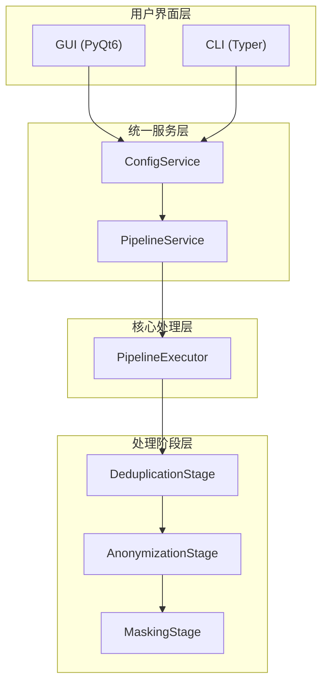

# PktMask 项目分析文档索引

> **分析日期**: 2025-10-09  
> **分析范围**: 完整代码库架构、数据流、设计模式  
> **文档状态**: ✅ 完成

---

## 📚 文档导航

本次分析生成了以下文档和可视化图表，帮助您全面理解 PktMask 项目：

### 🎯 技术评审文档 (2025-10-09 新增)

#### [TECHNICAL_REVIEW_SUMMARY.md](./TECHNICAL_REVIEW_SUMMARY.md) - 技术评审总结报告 ⭐⭐⭐ 强烈推荐
**适合人群**: 项目负责人、技术经理、架构师

**内容概览**:
- ✅ 总体评分（8个维度）
- ✅ 关键发现（优势与劣势）
- ✅ 35个问题分类汇总
- ✅ 优先修复建议（P0-P3）
- ✅ 改进效果预测
- ✅ 技术债务分析（9.5周工作量）

**阅读时间**: 约 20 分钟

---

#### [TECHNICAL_EVALUATION_AND_ISSUES.md](./TECHNICAL_EVALUATION_AND_ISSUES.md) - 完整技术评价和问题列表
**适合人群**: 开发者、代码审查者

**内容概览**:
- ✅ 8个严重问题详细分析（并发、依赖、性能等）
- ✅ 12个重要问题详细分析（安全、GUI、测试等）
- ✅ 15个次要问题列表
- ✅ 深度技术分析（Python、PyQt6、Scapy 最佳实践）
- ✅ 量化分析（代码质量指标、性能基准）
- ✅ 修复路线图（4个阶段）

**阅读时间**: 约 45-60 分钟

---

#### [ISSUES_CHECKLIST.md](./ISSUES_CHECKLIST.md) - 问题修复检查清单
**适合人群**: 开发者、项目经理

**内容概览**:
- ✅ 30个问题的详细检查清单
- ✅ 优先级分类（P0/P1/P2/P3）
- ✅ 预计修复时间和负责人分配
- ✅ 进度跟踪表格
- ✅ 里程碑设置

**用途**: 跟踪问题修复进度，分配任务

---

### 1. 📖 核心分析文档

#### [PROJECT_SUMMARY_CN.md](./PROJECT_SUMMARY_CN.md) - 项目解读总结（推荐首读）
**适合人群**: 所有开发者、项目管理者

**内容概览**:
- ✅ 项目概览与核心价值
- ✅ 三大核心功能详解（去重、匿名化、掩码）
- ✅ 架构设计与分层说明
- ✅ 数据处理流程（简化版）
- ✅ 关键类与接口
- ✅ 数据模型
- ✅ 技术栈与项目结构
- ✅ 设计亮点总结

**阅读时间**: 约 15 分钟

---

#### [PROJECT_ANALYSIS_AND_FLOW.md](./PROJECT_ANALYSIS_AND_FLOW.md) - 完整架构与流程分析
**适合人群**: 深度开发者、架构师

**内容概览**:
- ✅ 详细的架构层次说明
- ✅ 完整的数据处理流程（单文件、批量）
- ✅ 关键模块深度解析
- ✅ 配置数据流详解
- ✅ 数据包处理流详解
- ✅ 统计信息流
- ✅ 设计模式应用
- ✅ 错误处理机制
- ✅ 性能优化策略
- ✅ 测试策略
- ✅ 部署与打包

**阅读时间**: 约 30-40 分钟

---

### 2. 📊 可视化流程图

以下 Mermaid 图表已生成并可在支持的 Markdown 查看器中查看：

#### 图表 1: PktMask 整体架构图
**描述**: 展示从用户界面层到基础设施层的完整架构
**关键内容**:
- 用户界面层（GUI/CLI）
- 统一服务层（5个核心服务）
- 核心处理层（PipelineExecutor）
- 处理阶段层（3个Stage）
- 基础设施层（日志、错误处理、资源管理）

**查看方式**: 在 Markdown 查看器中打开本文档



---

#### 图表 2: 单文件处理流程图
**描述**: 展示从用户输入到处理完成的完整流程
**关键内容**:
- 输入验证
- 配置构建
- 执行器创建
- 三阶段处理（去重→匿名化→掩码）
- 结果聚合与报告

---

#### 图表 3: MaskingStage 双模块架构
**描述**: 展示 Marker 和 Masker 模块的协作流程
**关键内容**:
- Marker 模块（TShark 协议分析）
- 规则集生成（KeepRuleSet）
- Masker 模块（Scapy 载荷处理）
- 数据流转

---

#### 图表 4: 配置数据流转图
**描述**: 展示从 GUI/CLI 输入到 Stage 执行的配置转换
**关键内容**:
- GUI 复选框 → ProcessingOptions
- CLI 参数 → ProcessingOptions
- ProcessingOptions → PipelineConfig
- PipelineConfig → Stage 实例化

---

#### 图表 5: 数据包处理详细流程（时序图）
**描述**: 展示各组件间的交互时序
**关键内容**:
- 用户与 GUI/CLI 交互
- ConfigService 配置构建
- PipelineExecutor 执行调度
- 各 Stage 的处理细节
- 结果返回与报告生成

---

### 3. 🗂️ 相关架构文档

#### [ARCHITECTURE_UNIFIED.md](../ARCHITECTURE_UNIFIED.md)
**描述**: 官方统一架构文档
**内容**: 
- 架构层次说明
- 命名规范
- 配置统一机制
- 扩展性设计

---

## 🎯 快速导航指南

### 我想了解...

#### 项目整体情况
👉 阅读 [PROJECT_SUMMARY_CN.md](./PROJECT_SUMMARY_CN.md)

#### 如何添加新的处理阶段
👉 阅读 [PROJECT_ANALYSIS_AND_FLOW.md](./PROJECT_ANALYSIS_AND_FLOW.md) 的"关键模块解析 - StageBase"部分

#### GUI 和 CLI 如何共享逻辑
👉 查看"配置数据流转图"和 [PROJECT_SUMMARY_CN.md](./PROJECT_SUMMARY_CN.md) 的"设计亮点"部分

#### 掩码处理的实现细节
👉 查看"MaskingStage 双模块架构"图和 [PROJECT_ANALYSIS_AND_FLOW.md](./PROJECT_ANALYSIS_AND_FLOW.md) 的"MaskingStage"部分

#### 数据包是如何被处理的
👉 查看"数据包处理详细流程"时序图和 [PROJECT_ANALYSIS_AND_FLOW.md](./PROJECT_ANALYSIS_AND_FLOW.md) 的"数据包处理流"部分

#### 错误是如何处理的
👉 阅读 [PROJECT_ANALYSIS_AND_FLOW.md](./PROJECT_ANALYSIS_AND_FLOW.md) 的"错误处理机制"部分

#### 性能优化策略
👉 阅读 [PROJECT_ANALYSIS_AND_FLOW.md](./PROJECT_ANALYSIS_AND_FLOW.md) 的"性能优化"部分

---

## 📋 核心概念速查

### 关键类

| 类名 | 位置 | 职责 |
|------|------|------|
| `PipelineExecutor` | `core/pipeline/executor.py` | 核心执行引擎，调度各阶段 |
| `StageBase` | `core/pipeline/base_stage.py` | 处理阶段基类 |
| `DeduplicationStage` | `core/pipeline/stages/deduplication_stage.py` | 数据包去重 |
| `AnonymizationStage` | `core/pipeline/stages/anonymization_stage.py` | IP 匿名化 |
| `MaskingStage` | `core/pipeline/stages/masking_stage/stage.py` | 载荷掩码 |
| `ConfigService` | `services/config_service.py` | 配置服务 |

### 关键数据模型

| 模型 | 位置 | 用途 |
|------|------|------|
| `ProcessingOptions` | `services/config_service.py` | 处理选项配置 |
| `StageStats` | `core/pipeline/models.py` | 阶段统计信息 |
| `ProcessResult` | `core/pipeline/models.py` | 处理结果 |
| `PipelineEvents` | `core/events.py` | 管道事件枚举 |

### 关键流程

| 流程 | 说明 |
|------|------|
| **配置流** | GUI/CLI → ProcessingOptions → PipelineConfig → Executor |
| **执行流** | Input → Dedup → Anon → Mask → Output |
| **掩码流** | Input → Marker(TShark) → KeepRules → Masker(Scapy) → Output |
| **进度流** | Stage → ProgressCallback → GUI/CLI |

---

## 🔍 代码导航

### 想要查看某个功能的实现？

#### 去重功能
```
src/pktmask/core/pipeline/stages/deduplication_stage.py
  ├─ DeduplicationStage.process_file()  # 主处理逻辑
  └─ _compute_packet_hash()             # 哈希计算
```

#### IP 匿名化
```
src/pktmask/core/pipeline/stages/anonymization_stage.py
  ├─ AnonymizationStage.process_file()  # 主处理逻辑
  └─ HierarchicalAnonymizationStrategy  # 匿名化策略
```

#### 载荷掩码
```
src/pktmask/core/pipeline/stages/masking_stage/
  ├─ stage.py                           # MaskingStage 主类
  ├─ marker/                            # Marker 模块
  │   ├─ tls_marker.py                  # TLS 协议分析
  │   ├─ http_marker.py                 # HTTP 协议分析
  │   └─ auto_marker.py                 # 自动检测
  └─ masker/                            # Masker 模块
      └─ payload_masker.py              # 载荷处理
```

#### GUI 主窗口
```
src/pktmask/gui/
  ├─ main_window.py                     # 主窗口
  └─ managers/                          # 管理器
      ├─ ui_manager.py                  # UI 管理
      ├─ pipeline_manager.py            # 管道管理
      └─ file_manager.py                # 文件管理
```

#### CLI 命令
```
src/pktmask/cli/
  ├─ commands.py                        # CLI 命令
  └─ formatters.py                      # 输出格式化
```

---

## 🎓 学习路径建议

### 初学者路径
1. 阅读 [PROJECT_SUMMARY_CN.md](./PROJECT_SUMMARY_CN.md) - 了解项目整体
2. 查看"整体架构图" - 理解分层结构
3. 查看"单文件处理流程图" - 理解处理流程
4. 运行示例代码 - 实践操作

### 开发者路径
1. 阅读 [PROJECT_SUMMARY_CN.md](./PROJECT_SUMMARY_CN.md) - 快速了解
2. 阅读 [PROJECT_ANALYSIS_AND_FLOW.md](./PROJECT_ANALYSIS_AND_FLOW.md) - 深入理解
3. 查看所有流程图 - 可视化理解
4. 阅读源代码 - 掌握细节
5. 运行测试 - 验证理解

### 架构师路径
1. 阅读 [ARCHITECTURE_UNIFIED.md](../ARCHITECTURE_UNIFIED.md) - 官方架构
2. 阅读 [PROJECT_ANALYSIS_AND_FLOW.md](./PROJECT_ANALYSIS_AND_FLOW.md) - 完整分析
3. 研究设计模式应用 - 理解设计决策
4. 评估扩展性 - 规划未来发展

---

## 📝 文档维护

### 文档更新记录

| 日期 | 更新内容 | 作者 |
|------|---------|------|
| 2025-10-09 | 初始版本，完整项目分析 | AI Assistant |

### 文档反馈

如果您发现文档中的错误或有改进建议，请：
1. 在项目 Issue 中提出
2. 或直接提交 Pull Request

---

## 🔗 相关资源

### 官方文档
- [README.md](../../README.md) - 项目主页
- [用户文档](../user/README.md) - 用户指南
- [API 文档](../api/README.md) - API 参考

### 开发文档
- [开发者指南](./README.md) - 开发入门
- [测试文档](./testing/README.md) - 测试指南
- [架构分析](./architecture/README.md) - 架构深度分析

---

## ✅ 总结

本次分析提供了 PktMask 项目的全面解读，包括：

- ✅ **2 份详细文档** - 总结版和完整版
- ✅ **5 个可视化图表** - 架构图、流程图、时序图
- ✅ **完整的代码导航** - 快速定位关键代码
- ✅ **学习路径建议** - 适合不同角色

**建议**: 从 [PROJECT_SUMMARY_CN.md](./PROJECT_SUMMARY_CN.md) 开始阅读，然后根据需要深入其他文档。

---

**文档生成日期**: 2025-10-09  
**分析工具**: AI-Powered Code Analysis  
**文档格式**: Markdown + Mermaid

