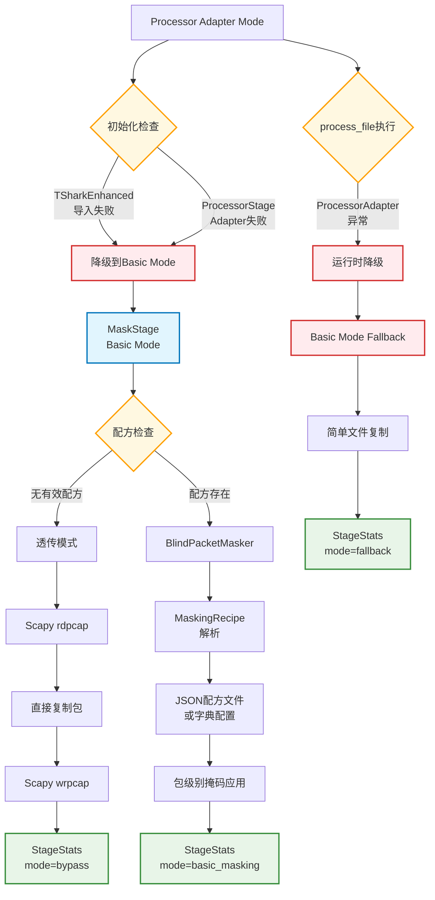
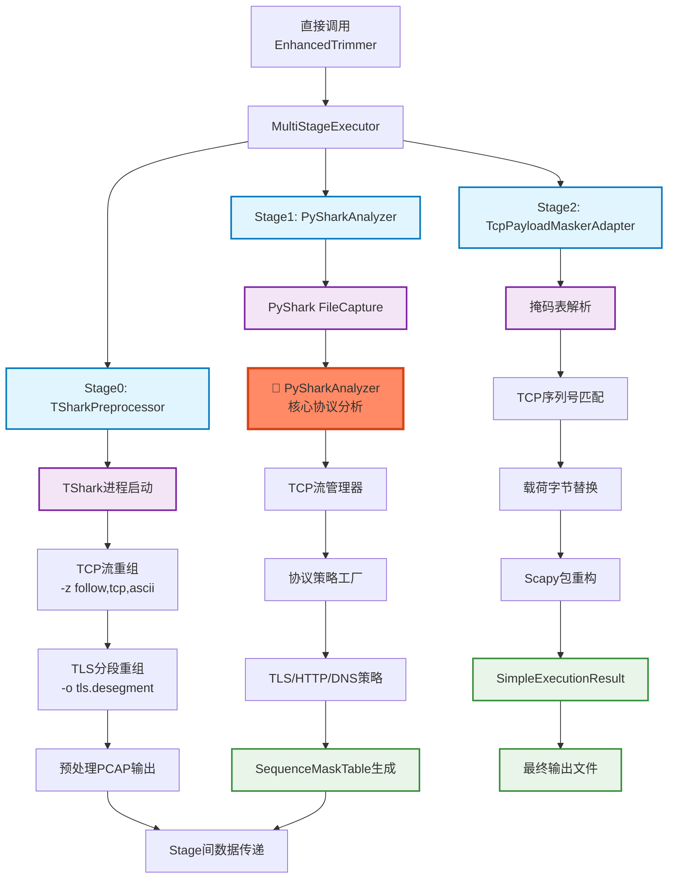
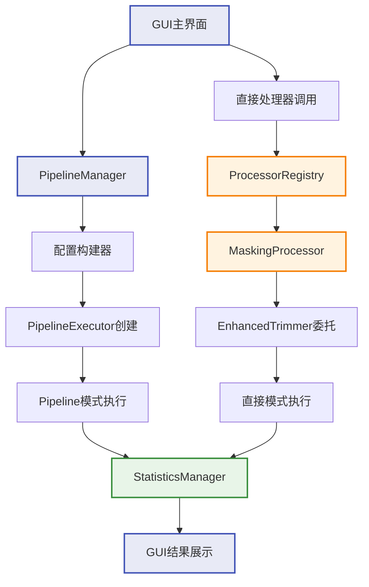
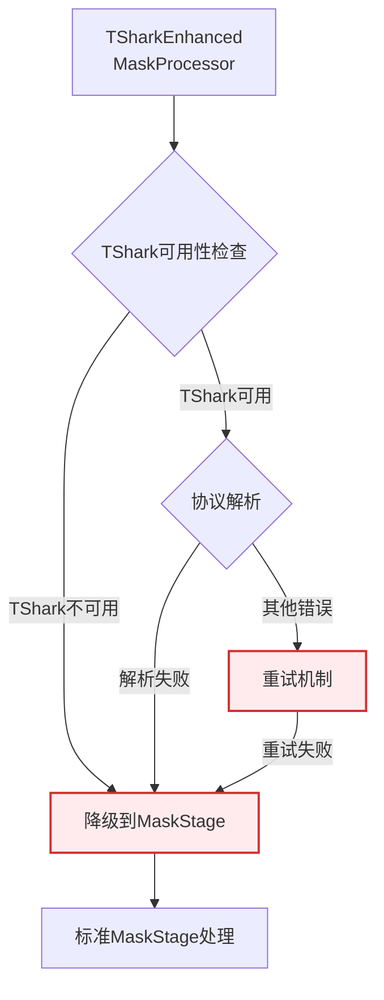
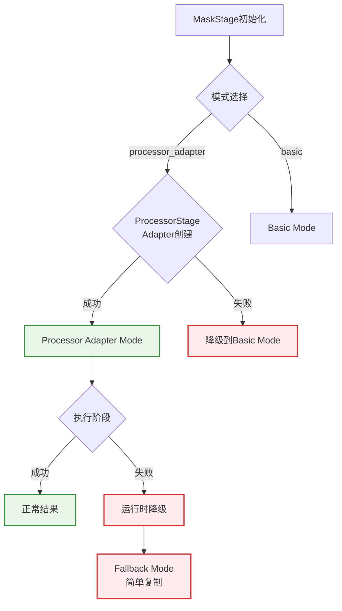

# PktMask 组件依赖与数据流图

> **版本**: v1.0  
> **创建时间**: 2025-07-XX  
> **作者**: Agent分析  
> **说明**: 以"Stage/Processor"为节点的完整架构流图，覆盖两种模式及降级路径

---

## 🏗️ 整体架构概览

```
PktMask 系统架构
├── Pipeline模式 (新架构)
│   ├── Processor Adapter Mode (默认)
│   └── Basic Mode (降级)
├── Direct调用模式 (旧架构保留)
└── GUI调用模式 (ProcessorRegistry桥接)
```

---

## 📊 模式1: Pipeline架构 - Processor Adapter Mode (默认)

### 主链路流程图

```mermaid
graph TD
    %% === 输入层 ===
    A[用户输入文件<br/>PCAP/PCAPNG] --> B[PipelineExecutor]
    
    %% === Pipeline配置 ===
    B --> C{配置检查}
    C -->|dedup.enabled=true| D[DedupStage]
    C -->|anon.enabled=true| E[AnonStage] 
    C -->|mask.enabled=true| F[MaskStage]
    
    %% === DedupStage ===
    D --> D1[Deduplicator<br/>Processor]
    D1 --> D2[Scapy rdpcap]
    D2 --> D3[哈希去重算法]
    D3 --> D4[Scapy wrpcap]
    D4 --> D5[StageStats<br/>去重统计]
    
    %% === AnonStage ===
    D5 --> E
    E --> E1[IPAnonymizer<br/>Processor]
    E1 --> E2[HierarchicalAnonymization<br/>Strategy]
    E2 --> E3[IP地址映射表]
    E3 --> E4[Scapy包修改]
    E4 --> E5[StageStats<br/>匿名化统计]
    
    %% === MaskStage (Processor Adapter Mode) ===
    E5 --> F
    F --> F1{mode检查}
    F1 -->|processor_adapter| G[ProcessorStageAdapter]
    
    %% === TSharkEnhancedMaskProcessor 三阶段链路 ===
    G --> H[TSharkEnhancedMaskProcessor]
    H --> I[阶段1: TSharkTLSAnalyzer]
    I --> J[阶段2: TLSMaskRuleGenerator] 
    J --> K[阶段3: ScapyMaskApplier]
    
    %% === TShark分析阶段 ===
    I --> I1[TShark进程调用]
    I1 --> I2[TCP流重组<br/>IP碎片重组]
    I2 --> I3[TLS协议解析]
    I3 --> I4[TLSRecord结构]
    
    %% === 规则生成阶段 ===
    J --> J1[协议类型识别]
    J1 --> J2[TLS策略应用<br/>20/21/22:保留<br/>23:掩码<br/>24:保留]
    J2 --> J3[跨包分段处理]
    J3 --> J4[MaskRule生成]
    
    %% === Scapy应用阶段 ===
    K --> K1[序列号匹配]
    K1 --> K2[载荷字节修改]
    K2 --> K3[校验和重计算]
    K3 --> K4[ProcessorResult]
    
    %% === 结果转换 ===
    K4 --> L[ProcessorStageAdapter<br/>结果转换]
    L --> M[StageStats<br/>掩码统计]
    
    %% === 最终输出 ===
    M --> N[临时目录清理]
    N --> O[输出文件<br/>PCAP/PCAPNG]
    O --> P[ProcessResult<br/>完整统计]
    
    %% === 样式定义 ===
    classDef stageNode fill:#e1f5fe,stroke:#0277bd,stroke-width:2px
    classDef processorNode fill:#f3e5f5,stroke:#7b1fa2,stroke-width:2px
    classDef analyzerNode fill:#fff3e0,stroke:#f57c00,stroke-width:2px
    classDef dataNode fill:#e8f5e8,stroke:#388e3c,stroke-width:2px
    classDef configNode fill:#fff8e1,stroke:#ffa000,stroke-width:2px
    
    class D,E,F stageNode
    class D1,E1,H,I,J,K processorNode  
    class I1,I2,I3,J1,J2,K1,K2 analyzerNode
    class D5,E5,M,P dataNode
    class C,F1 configNode
```

### PySharkAnalyzer 在主链路中的位置

**❌ PySharkAnalyzer 不在 Processor Adapter Mode 主链路中**

- **当前主链路**: TSharkTLSAnalyzer → TLSMaskRuleGenerator → ScapyMaskApplier
- **PySharkAnalyzer 位置**: 仅在 Enhanced Mode (已弃用) 中使用
- **路径**: `src/pktmask/core/trim/stages/pyshark_analyzer.py` (独立组件)

---

## 📊 模式2: Pipeline架构 - Basic Mode (降级)

### 降级链路流程图



---

## 📊 模式3: Direct调用模式 (旧架构保留)

### EnhancedTrimmer 直接调用链路



**✅ PySharkAnalyzer 在 EnhancedTrimmer 链路中的核心位置**

- **文件位置**: `src/pktmask/core/trim/stages/pyshark_analyzer.py`
- **功能角色**: Stage1 核心协议分析器
- **主要职责**: 
  - 深度协议识别 (TLS/HTTP/DNS/ICMP)
  - TCP流管理和方向性检测
  - 序列号范围计算
  - SequenceMaskTable生成
  - TLS重组包检测和标记

---

## 📊 模式4: GUI调用模式 (ProcessorRegistry桥接)

### GUI集成架构



---

## 🔄 降级路径详细说明

### 1. TSharkEnhancedMaskProcessor 降级机制



### 2. MaskStage 内部降级机制



### 3. EnhancedTrimmer 内部降级 (深层降级)

根据文档 `MASK_STAGE_EXECUTION_FLOW_ANALYSIS.md`：

| 错误上下文 | 降级模式 | 具体处理 |
|------------|----------|----------|
| "TShark不可用" | ENHANCED_TRIMMER | 切换到 EnhancedTrimmer 处理器 |
| "tshark command failed" | ENHANCED_TRIMMER | 切换到 EnhancedTrimmer 处理器 |
| "协议解析失败" | MASK_STAGE | 切换到 MaskStage 处理器 |
| "protocol parsing error" | MASK_STAGE | 切换到 MaskStage 处理器 |
| "unknown error" | ENHANCED_TRIMMER | 默认切换到 EnhancedTrimmer |

**多级降级级联路径**:
```
TShark 主处理失败 → EnhancedTrimmer → MaskStage → 完全失败
协议解析失败 → MaskStage → EnhancedTrimmer → 完全失败
其他错误 → EnhancedTrimmer → MaskStage → 完全失败
```

---

## 📝 组件依赖关系总结

### Stage/Processor 节点列表

| 类型 | 组件名称 | 文件路径 | 主要功能 |
|------|----------|----------|----------|
| **Pipeline Stages** | | | |
| Stage | DedupStage | `core/pipeline/stages/dedup.py` | 数据包去重 |
| Stage | AnonStage | `core/pipeline/stages/anon_ip.py` | IP地址匿名化 |
| Stage | MaskStage | `core/pipeline/stages/mask_payload/stage.py` | 载荷掩码(双模式) |
| **Processors** | | | |
| Processor | Deduplicator | `core/processors/deduplicator.py` | 哈希去重处理 |
| Processor | IPAnonymizer | `core/processors/ip_anonymizer.py` | 分层IP匿名化 |
| Processor | TSharkEnhancedMaskProcessor | `core/processors/tshark_enhanced_mask_processor.py` | TShark增强掩码 |
| **Analyzer Components** | | | |
| ❌ Analyzer | PySharkAnalyzer | `core/trim/stages/pyshark_analyzer.py` | **不在主链路** |
| Analyzer | TSharkTLSAnalyzer | `core/processors/tshark_tls_analyzer.py` | TShark TLS分析 |
| Analyzer | TLSMaskRuleGenerator | `core/processors/tls_mask_rule_generator.py` | TLS掩码规则生成 |
| Analyzer | ScapyMaskApplier | `core/processors/scapy_mask_applier.py` | Scapy掩码应用 |
| **Adapters** | | | |
| Adapter | ProcessorStageAdapter | `core/pipeline/stages/processor_stage_adapter.py` | Processor→Stage适配 |
| **Legacy Components** | | | |
| Legacy | EnhancedTrimmer | `core/processors/enhanced_trimmer.py` | 完整多阶段处理 |
| Legacy | MultiStageExecutor | `core/trim/multi_stage_executor.py` | 多阶段执行器 |

### 数据流向说明

1. **文件流向**: PCAP输入 → Stage链式处理 → PCAP输出
2. **函数调用流向**: PipelineExecutor → Stages → Processors → 底层工具
3. **配置传播**: 顶层config → Stage配置 → Processor配置
4. **统计收集**: 底层结果 → ProcessorResult → StageStats → ProcessResult
5. **错误传播**: 异常捕获 → 降级处理 → 结果标记

### PySharkAnalyzer 总结

- **主链路地位**: ❌ **不在当前生产主链路中**
- **实际位置**: EnhancedTrimmer的Stage1组件 (旧架构)
- **功能价值**: 深度协议分析，序列号掩码表生成
- **未来规划**: 可能集成到新架构的增强功能中

---

**文档状态**: ✅ 完成  
**覆盖范围**: 两种模式 + 降级路径 + PySharkAnalyzer定位  
**维护者**: PktMask Development Team
